# Food DELIVERY APP using React-Native ( EXPO )

## Table of Contents

| Code | Project | Preview | Inspiration | No. of Screens |
| ------ | ------ | ------ | ------ | ------ |
| LCRN08 |
 [Food Delivery App]| 

 ## SCREEN SHOTS

 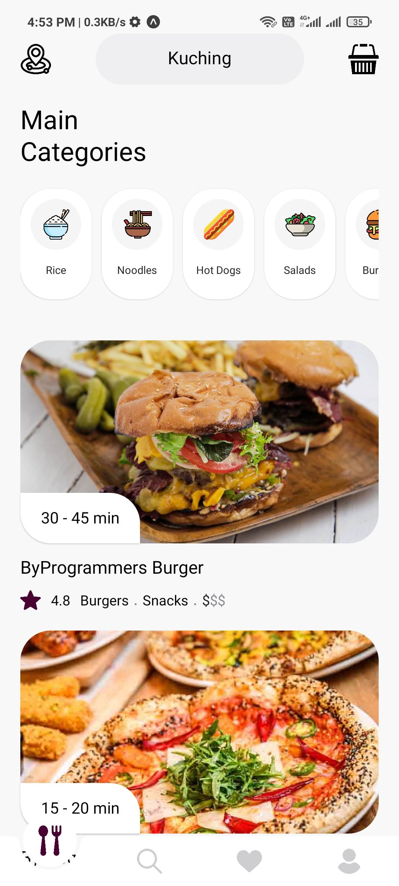 
 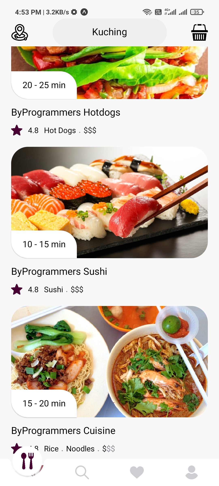 
 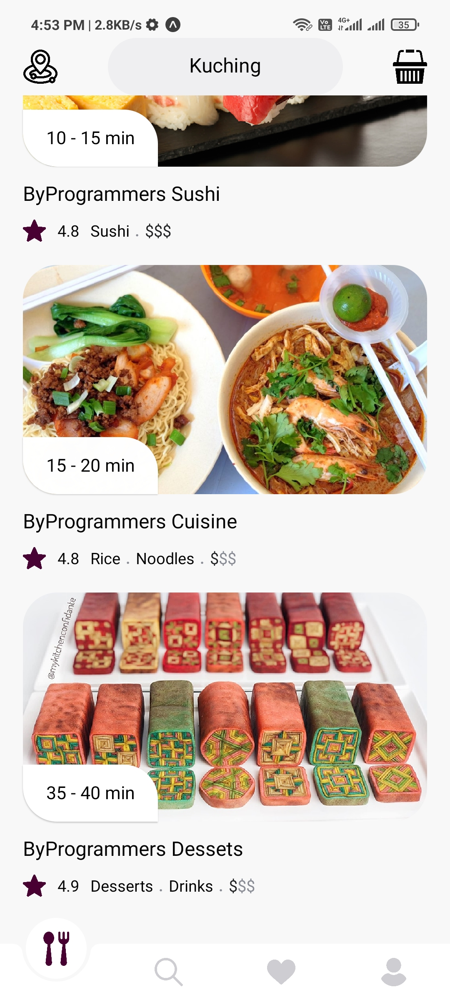 
 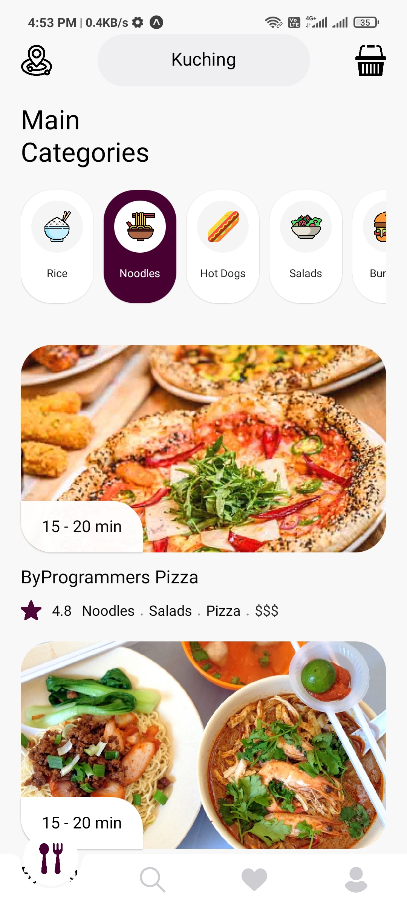 
 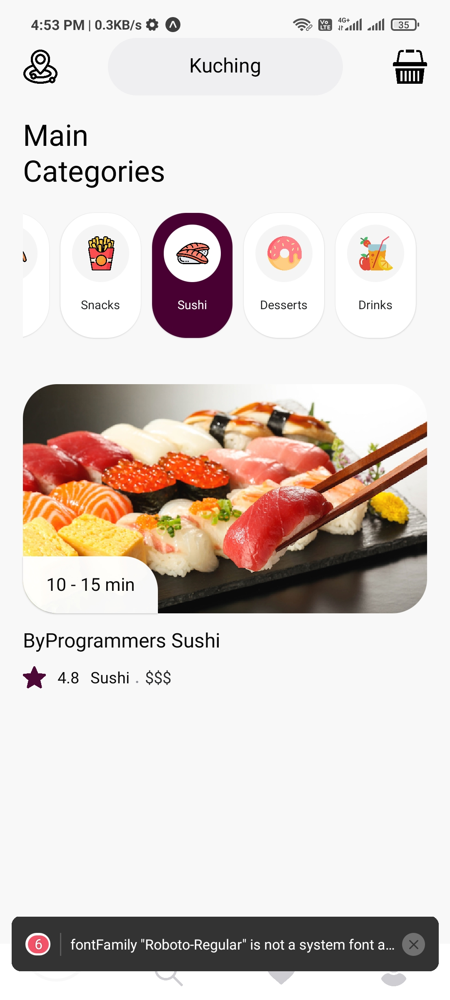 
 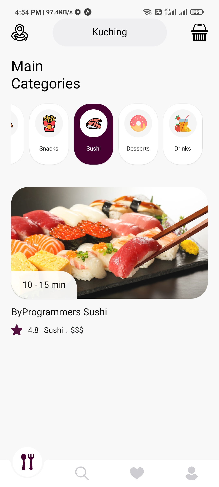 
 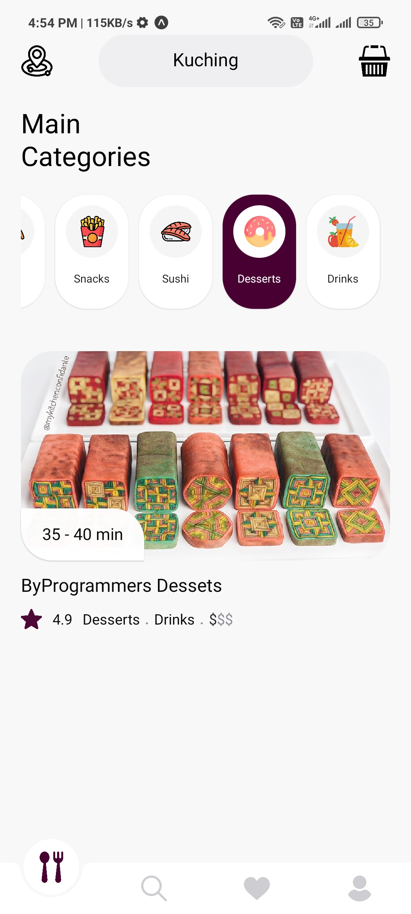 
 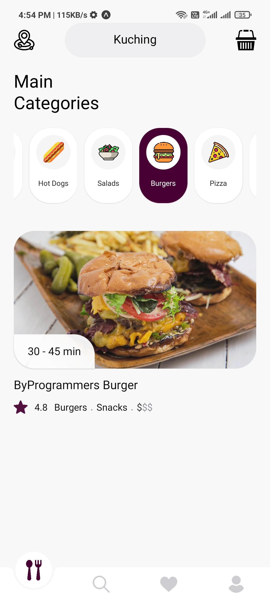 
 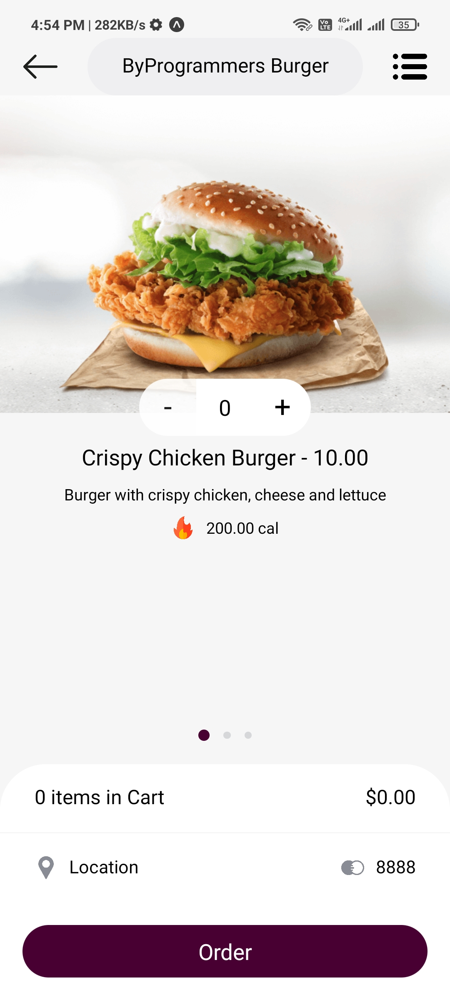 
 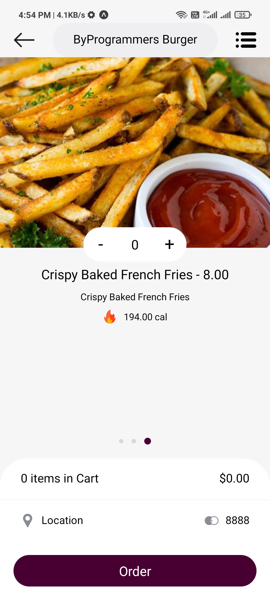 
 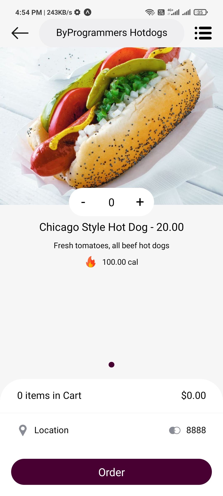 
 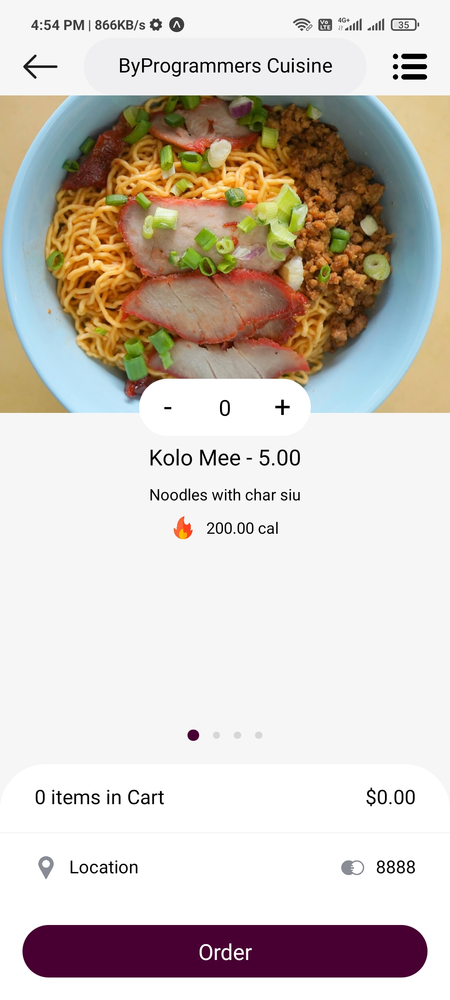 
 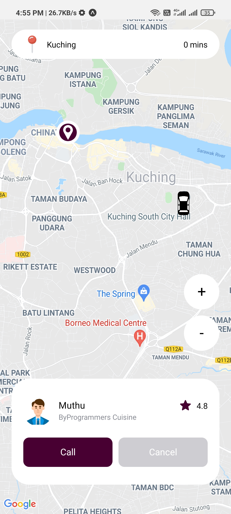 
 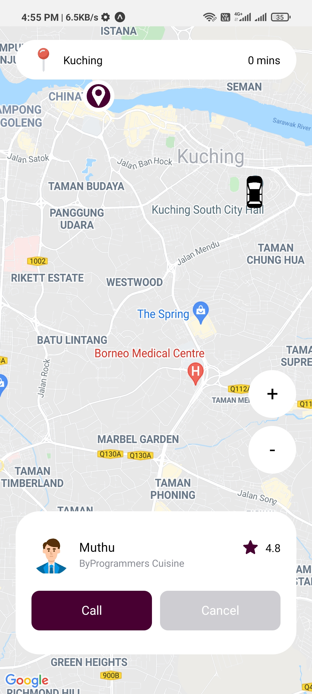 
 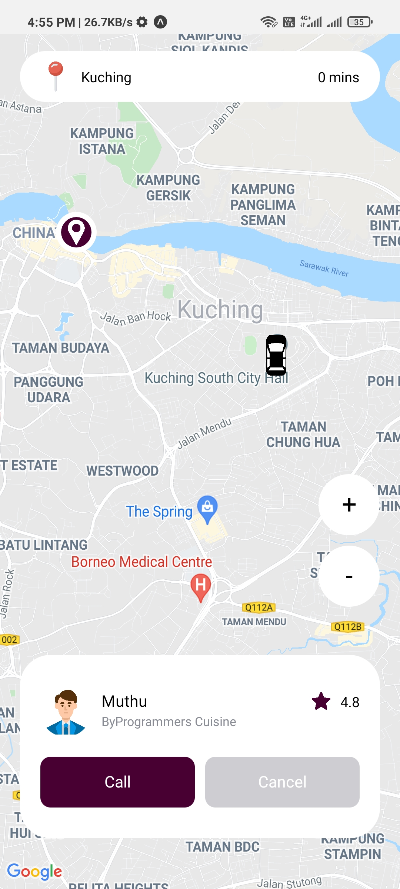 
 
 
 
 
 
 | 

<!-- 
 [View](https://dribbble.com/shots/14527824-Food-Delivery-Mobile-App) | 3 | -->

## Contributors

